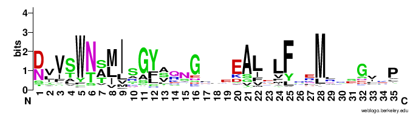
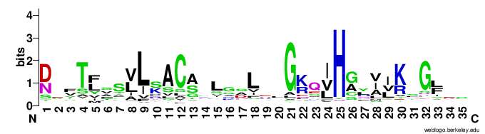
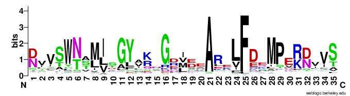
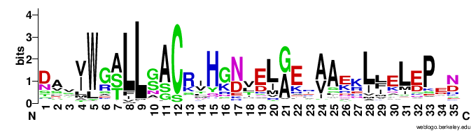
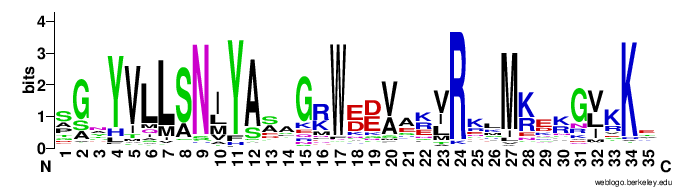

# PPR Motif Annotation using Neural Network

## Overview  
This is the code and weight files to run and deploy the Flask app [PPR motif](https://ppr-motif.appspot.com/), which uses pre-trained Keras model to predict 10 different variants of [PPR motif](http://onlinelibrary.wiley.com/doi/10.1111/tpj.13121/full#tpj13121-sec-0002). However, we still use [PROSITE model](https://prosite.expasy.org/PDOC51375) of the PPR motif.

## Sequence logo of *Arabidopsis thaliana* PPR motif variants  
P    
  
P1   
  
P2   
  
L1   
  
L2   
  
S1   
  
S2   
  
SS   
  
E1   
  
E2   
  

## Dependencies  
```sudo pip install -r requirements.txt```

## Todo 
- [ ] Bugs
    - [x] Handling inputs.
    - [ ] Ending positions of the features.
    - [x] Bed format positions of the features.
- [ ] Optimization
    - [ ] Variable length features (pad_sequences?).
    - [ ] Unbalanced training set (sample_weight?).
    - [ ] Under-represented classes (class_weight?).
- [ ] Features
    - [ ] Setting maximum number of query sequences.  
    - [x] Uploading example query sequences from file.  
    - [ ] Uploading query sequences from file.  
    - [ ] Displaying and downloading annotations in either bed or GFF3 format.  